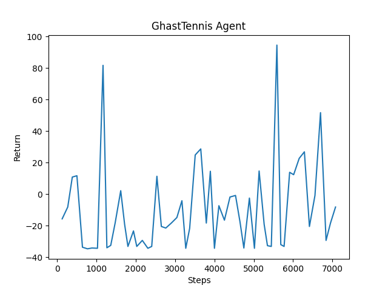
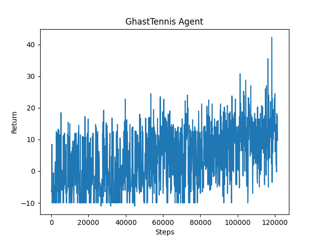

## Video Summary

<iframe class="youtube" height="300" src="https://www.youtube.com/embed/rtuoWLXzSug&feature=youtu.be" frameborder="0" allow="accelerometer; autoplay; clipboard-write; encrypted-media; gyroscope; picture-in-picture" allowfullscreen></iframe>

## Project Summary

In Minecraft, ghasts are large flying mobs that can shoot fireballs at the player. The player can deflect the fireball by hitting it with the correct timing. Here is a video on how it works:

<iframe class="youtube" height="300" src="https://www.youtube.com/embed/sMioimZS_gY" frameborder="0" allow="accelerometer; autoplay; clipboard-write; encrypted-media; gyroscope; picture-in-picture" allowfullscreen></iframe>

For our project, our agent will learn how to kill ghasts by deflecting fireballs back at them. Our agent will be given the position and heading of incoming fireballs, and the position of the ghast, and will have to learn where to aim and with what timing to swing to redirect the fireball at the ghast.

## Approach

To train our agent, we use the RLlib reinforcement learning framework with the Proximal Policy Optimization (PPO) algorithm.

Our current environment consists of an open space with a stationary ghast spawn at a random x-position in front of the player. The agent is made invincible and it is also trapped in a box to prevent knockback since we are mainly training our agent to aim.

### Observation Space

The observation space contains the location and speed of ghasts and fireballs in the environment in addition to the agent’s relative yaw and position.

### Action Space

We converted the agent to a continuous action space because, in order to hit the ghast, the agent needs precise actions. Currently there are two actions in the action space: attack and turn. The attack parameter is converted into a binary action since it is not a continuous action. Eventually when we let the ghast freely move we will have to add pitch to our action space.

### Rewards

The agent is rewarded when it is able to redirect a fireball. It is given a higher reward when the fireball is approximately close to the ghast while a huge reward is given when the agent is successful at killing the ghast. The negative rewards are calculated based on how many fireballs the ghast produced in order for the agent to kill the ghast. This rewards the agent to kill the ghast with the least amount of fireballs the ghast produces.

The mission ends when the agent is successful at killing the ghast or if 30 seconds has passed since the beginning of the mission.

### Neural Network Implementation

<iframe class="youtube" height="300" src="https://youtu.be/embed/KMJIm6vTn3o" frameborder="0" allow="accelerometer; autoplay; clipboard-write; encrypted-media; gyroscope; picture-in-picture" allowfullscreen></iframe>

Our original plan was to use a Q-learning algorithm but we also had an interest in learning about neural networks so we decided to pursue both in parallel. One of our team members started his research on Youtube and Reddit and began implementing his own neural network from scratch - using only numpy, and pyplot to display debugging information. We wanted something generalizable and simple to use, read, and understand. Another potential merit of doing this instead of simply using RLlib or something similar inside of malmo is that since - in our case - our agent is solving a task that can be simply simulated in code, we could train it in real time as opposed to waiting .05s for each minecraft update to be delivered. We could get much more training done in a much shorter amount of time. It took our team member about a week to get a network that successfully predicted and learned, but initially only achieved 43% accuracy on written number recognition using the MNIST dataset (10% baseline).  He then decided to move from Jupyter Notebooks to normal Python files so that he could use a debugger and rewrote the code.

The initial neural network used a leaky relU activation function, a 784 by 200 by 10 topology, and a softmax activation function for the output layer. It suffered issues from NaN propagation which required fixing early on. Since then our team member have performed the following experiments and changes to improve its accuracy from 43% to 86%, or 90% when trained on the full dataset as opposed to just 10% of it. 

* Random starting values between 0 and 1 vs between -(1/layersize) to +(1/layersize) to simply 1 make no difference on accuracy or training speed, but starting with 1s makes debugging easier.

* Random bias values initialized to 0 instead - aids debugging but no change to accuracy.

* Leaky Rel U changed to sigmoid  - increased accuracy from 43% to 53%.

* Softmax changed to sigmoid and topology reduced to 784 by 10 - increased accuracy from 57% to 86%.

* Changing error to be softmax(error) when feedback to backpropagation took my initial build with a softmax activation function on the final layer better - 53% to 57% - but likewise feeding back the sigmoid of the error has the opposite effect on the new version, taking it from 86% to 79%.

* Decreasing the learning rate geometrically after each “epoch” , or loop over the same training data, has between a -1% to 1% effect on accuracy.

Increasing the complexity of the network beyond 2 layers currently renders it inaccurate, and the ABS(SUM( x )) function on the total change to the weight matrices, which are called axons here, shows a straight line, indicating that learning is not occurring. This could be caused by a bug in the backpropagation code for deeper networks.

We will be moving to PyTorch in the future, as the basic python implementation has served its purpose of teaching us how to create and debug neural networks. We have created a heavily commented and short class to demonstrate its functionality, and even a large drawing explaining how it works to aid understanding. We will also use it to test out changes in an easy to read and debug setting. 

From here on, our team needs to create a neural network that implements an evolution algorithm instead of gradient descent, so that it can be trained using reinforcement learning. 

## Evaluation

### Quantitative

While there isn’t noticeable improvement in the beginning of training (figure 1), our quantitative evaluation shows that there is slight improvement with our agent after a couple hours of training as shown in this graph (figure 2).

### Qualitative

Though the quantitative results don’t show much improvement, after watching the agent we can see noticeable improvement that the agent accuracy improves in terms of hitting more fireballs, and hitting ghasts more often than its initial training (shown in the demo video).

#### (figure 1)

#### (figure 2)

## Remaining Goals and Challenges

Currently, for training, we only spawned one stationary ghast per session for the agent to kill. Our plan for the final report is to make the agent work with a moving ghast and possibly multiple ghasts at the same session.

In addition we plan on adjusting the observation space, action space and rewards in order to get better results. We also plan on logging different results in order to better observe the performance of our agent.

## Resources Used

* [Malmo’s Mission Handlers Documentation](https://microsoft.github.io/malmo/0.14.0/Schemas/MissionHandlers.html)

* [Malmo’s Agent Host Documentation](https://microsoft.github.io/malmo/0.14.0/Documentation/classmalmo_1_1_agent_host.html)

* [RLlib Documentation](https://docs.ray.io/en/releases-0.8.1/rllib-algorithms.html)

* [Proximal Policy Optimization Algorithm](https://arxiv.org/abs/1707.06347)

* [Neural Network Explained](https://www.youtube.com/watch?v=9RN2Wr8xvro&list=PL-nR3Zo5zPQvaNGqElO9-N-1z-4N94qBi&index=1)

* [PyTorch in 5 Minutes](https://www.youtube.com/watch?v=nbJ-2G2GXL0&list=PL-nR3Zo5zPQvaNGqElO9-N-1z-4N94qBi&index=1)

* [Which Activation Function Should I Use?](https://www.youtube.com/watch?v=-7scQpJT7uo&list=PL-nR3Zo5zPQvaNGqElO9-N-1z-4N94qBi&index=4)

* [Machine Learning for Video Games](https://www.youtube.com/watch?v=qv6UVOQ0F44&list=PL-nR3Zo5zPQvaNGqElO9-N-1z-4N94qBi&index=3)
